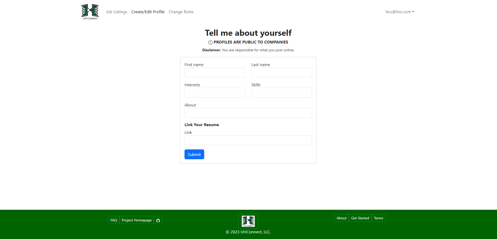

<style>
  img {
    border-style: solid;
    border-width: 5px;
    border-color: green;
  }
</style>

<h1>Welcome to UH-Connect!</h1>

<h3>Find your dream job today!</h3>

<h1><a href="http://147.182.198.52">Click Here to Visit Our App!</a></h1>

<h3>More About Us</h3>
<ul>
  <li><a href="#our-mission">Our Mission</a></li>
  <li><a href="#user-guide">User Guide</a></li>
  <li><a href="#behind-the-scenes">Behind the Scenes</a></li>
  <li><a href="#organization">Organization</a></li>
  <li><a href="#team-members">Team Members</a></li>
  <li><a href="#contract">Contract</a></li>
</ul>

<h2 id="our-mission">Our Mission</h2>

We aim to introduce employers to talented  UH students, as well as give students the positions they deserve in their careers.

Our app is that bridge that connects the two parties. Modern career apps such as Indeed allow very little interaction. We wanted to make it easier for the two parties to message each other quickly and show interest much more easily.

<h2 id="user-guide">User Guide</h2>

Upon reaching our pages, you'll be greeted with the following landing page.


You'll need an account to use our site's content.

By clicking the "sign up" button, you'll be transferred to the following sign-up page. Here you can create a username and password.


By signing up, you can access the account in the future. If you are not signed in on the landing page, you can click the "sign in" dropdown on the top right corner of the navbar.


This will lead you to the following page. Here instead of registering your account, you will be asked to put your password in.


Your first time signing in, you will be asked to select a role. (Note: placeholder image)


By clicking on the "Select Role" button, you'll be redirected to the role select page. On this page, you'll be able to choose whether you wish to continue as a student or a company.

Don't worry, this can be changed later.


<h3>Student View</h3>

If you choose to continue as a student, you will be greeted with the following landing page. (Note: placeholder image)


From here, you will gain access to job listings and profile editing. These features can be accessed on the navbar as well as near the bottom of the screen.

The profile editing page looks like this. This will create, or edit, a profile for employers to view.



The following would be how your profile would look to you as a student.


For job searching, students can view the Job listings page. As a student, you have the ability to add jobs to your saved jobs list.


Once saved, students can view their list of saved jobs in the top right corner of their screen, above the signout button. It will bring you to a screen with all your saved jobs.


<h3>Company View</h3>

If you choose to continue as a company, you will be greeted with the following landing page. (Note: placeholder image)


From here, you will gain access to job listings, just like the students. You will also gain access to add jobs and recruiting.

Adding a job allows students to view it and save it.


Jobs added by the company can be viewed on the navbar. This will only display jobs created by the user.


To view currently existing student profiles, companies can click on the recruit tab to see available candidates.


Like the students, companies can add students to a saved list.


<h3>Admin View<h3>

There is also a different landing page for admins. Admins have access to both the job listings as well as student profile viewing.


<h3>More Information</h3>

At the bottom of the page, you can find the footer with several links.


The first of these links is the FAQ. It gives a list of frequently asked questions.


The second of these links is our project homepage. It simply brings the user back to this page.

The third leads to our GitHub page.

The one in the middle brings the user back to the landing page.

The fourth button brings the user to the About page. It gives an overview of our app.


The fifth page is the Get Started page. This page is still a work in progress.

The sixth page is the terms of service page. It is a brief overview of expected behavior while using our app.


<h2>Developer Guide</h2>

In order for UH-Connect to run, I will list all the software needed.

* Git (or Anything that will clone a Git Repository)
* MeteorJS
* Terminal (or PowerShell/Command Prompt)
* NodeJS (Version: Node v12)
* Node Version Manager (Use NVM, you might need to change Node versions occasionally)

Once all of these are installed, Go into your terminal (or Powershell, etc...), and clone our repository. If you are using using Git commands do ```git clone https://github.com/uh-connect/uh-connect.git```. Once you have clone the repository, go into its directory, and move into the app folder. Once in the app folder, then run the command ```meteor npm install```. This will install all the dependencies needed for the app to run. Then you run the command ```meteor npm run start```, this will start to run the app, and give you a link to the app. Now you should have a local version of our App running on your system.

<h2 id="behind-the-scenes">Behind the Scenes</h2>

Our App runs on multiple layers of technology:
<ul>
  <li><a href="https://www.meteor.com/">Meteor</a> is how our project base code is created</li>
  <li><a href="https://www.digitalocean.com//">Digital Ocean</a> for hosting our website app</li>
</ul>

<h2>Early Feedback</h2>

"Your interface is nice and straightforward. The nice color and template choice for the website makes it stand out without being overbearing like some other sites. could use a more in-depth home page with some cool animations but it is what it is" - Anonymous

"The navbar color seems to blend into the background. This would look better if it isn't the same color." - Anonymous

"The role change should take you back to the landing page." - Anonymous

"It is very confusing if we have our role have been selected." - Anonymous

"Checkmark doesn't disappear unless confirmed. It should be fine, though." - Anonymous

<h2 id="organization">Organization</h2>

All of our work is available for others to view.
<h4><a href="https://github.com/uh-connect">Click Here to Visit Our Github Organization!</a></h4>


<h2 id="team-members">Team Members</h2>
<ul>
  <li><a href="https://github.com/andreww9924">Andrew Wan</a></li>
  <li><a href="https://github.com/lsanderson1">Lloyd Sanderson</a></li>
  <li><a href="https://github.com/kyletakeda">Kyle Takeda</a></li>
  <li><a href="https://github.com/TannerBerry">Tanner Berry</a></li>
  <li><a href="https://github.com/tsistoza">Vinton Sistoza</a></li>
</ul>

<h2 id="contract">Our Contract</h2>

<h4><a href="https://docs.google.com/document/d/1pMejVwFS32Qq-ZSnMN_upGQRkf20CDSqQLBBMPb7wD8/edit">Click here to view our project contract!</a></h4>

<h2 id="projectboard">Project Board</h2>

<h4><a href="https://github.com/orgs/uh-connect/projects/1/views/1">Click here to view our project board for Milestone 1!</a></h4>

<h4><a href="https://github.com/orgs/uh-connect/projects/2/views/1">Click here to view our project board for Milestone 2!</a></h4>

<h4><a href="https://github.com/orgs/uh-connect/projects/3/views/1">Click here to view our project board for Milestone 3!</a></h4>
